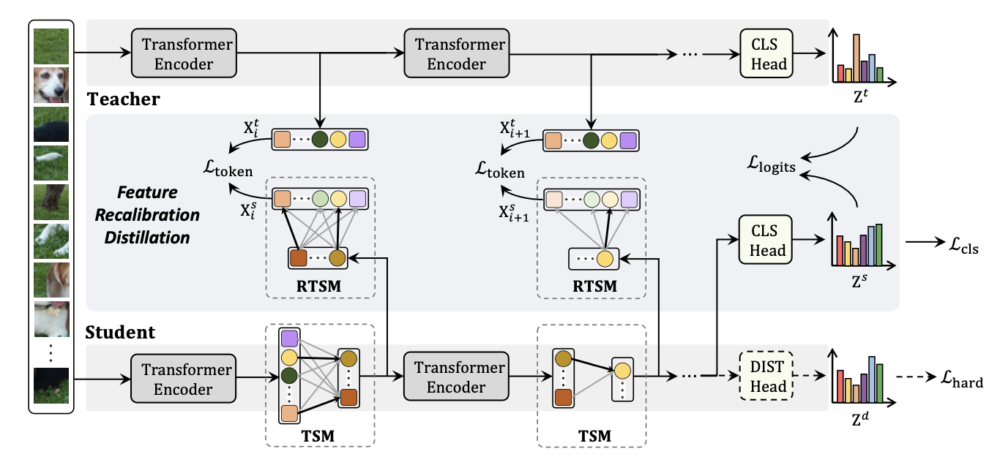

# Self-slimmed Vision Transformer (ECCV2022)

This repo is the official implementation of  ["Self-slimmed Vision Transformer"](https://arxiv.org/pdf/2111.12624.pdf).


## Updates

***07/20/2022***

**\[Initial commits\]:**

1. The supported code and models for LV-ViT are provided.

   

## Introduction

**SiT** (Self-slimmed Vision Transformer) is introduce in [arxiv](https://arxiv.org/abs/2111.12624) and serves as a generic self-slimmed learning method for vanilla vision transformers. Our concise TSM (Token Slimming Module) softly integrates redundant tokens into fewer informative ones. For stable and efficient training, we introduce a novel FRD framework to leverage structure knowledge, which can densely transfer token information in a flexible auto-encoder manner.

Our SiT can speed up ViTs by 1.7x with negligible accuracy drop, and even speed up ViTs by 3.6x while maintaining 97% of their performance. Surprisingly, by simply arming LV-ViT with our SiT, we achieve new state-of-the-art performance on ImageNet, surpassing all the recent CNNs and ViTs.


## Main results on LV-ViT

We follow the settings of [LeViT](https://github.com/facebookresearch/LeViT/blob/main/speed_test.py) for inference speed evaluation.

| Model  | Teacher  | Resolution | Top-1 | #Param. | FLOPs | Ckpt | Shell |
| ------ | -------- | ---------- | ----- | ------- | ----- | ---- | ----- |
| SiT-T  | LV-ViT-T | 224x224    | 80.1  |  15.9M  | 1.0G  | [google](https://drive.google.com/file/d/1hUGQU8Z4WxdgU7yePxZSOsp5vG_wSkja/view?usp=sharing) | [train.sh](exp/sit_lvvit_tiny/train.sh) |
| SiT-XS | LV-ViT-S | 224x224    | 81.2  |  25.6M  | 1.5G  | [google](https://drive.google.com/file/d/10xKbVwI_l4tQaJJmUSorGhl_S2w0iAJL/view?usp=sharing) | [train.sh](exp/sit_lvvit_xsmall/train.sh) |
| SiT-S  | LV-ViT-S | 224x224    | 83.1  |  25.6M  | 4.0G  | [google](https://drive.google.com/file/d/1nLurrn8t_KzdXw0eGpSttad5vYa_wMIk/view?usp=sharing) | [train.sh](exp/sit_lvvit_small/train.sh) |
| SiT-M  | LV-ViT-M | 224x224    | 84.2  |  55.6M  | 8.1G  | [google](https://drive.google.com/file/d/1Xt8w9qZ2MMFOfohFwCn6mX0hqW6J0fnL/view?usp=sharing) | [train.sh](exp/sit_lvvit_medium/train.sh) |
| SiT-L  | LV-ViT-L | 288x288    | 85.6  |  148.2M | 34.4G | [google](https://drive.google.com/file/d/1N-RMArXD_GsUgGKpLePhJTOpTZImas2G/view?usp=sharing) | [train.sh](exp/sit_lvvit_large/train.sh) |


The LV-ViT teacher models are trained with [token-labeling](https://github.com/zihangJiang/TokenLabeling) and their checkpoints are provided.

| Model    | Resolution | Top-1 | #Param. | FLOPs | Ckpt |
| -------- | ---------- | ----- | ------- | ----- | ---- |
| LV-ViT-T | 224x224    | 81.8  |  15.7M  | 3.5G  | [google](https://drive.google.com/file/d/1OAVDvMosOIGTEL4dku8WtC50Dn6k0ngJ/view?usp=sharing) |
| LV-ViT-S | 224x224    | 83.1  |  25.4M  | 5.5G  | [google](https://drive.google.com/file/d/1LeSnPfPqG63jUIIyqag4VOL_ICF783pb/view?usp=sharing) |
| LV-ViT-M | 224x224    | 84.0  |  55.2M  | 11.9G | [google](https://drive.google.com/file/d/12nz4MgW9-VUmNoNGaqJyEYlNbN923hmU/view?usp=sharing) |
| LV-ViT-L | 288x288    | 85.3  |  147M   | 56.1G | [google](https://drive.google.com/file/d/1-dInCKaMZbcturbbt6ssWr9oI1aEI1yZ/view?usp=sharing) |

##  Cite SiT

If you find this repository useful, please use the following BibTeX entry for citation.

```latex
@misc{zong2021self,
      title={Self-slimmed Vision Transformer}, 
      author={Zhuofan Zong and Kunchang Li and Guanglu Song and Yali Wang and Yu Qiao and Biao Leng and Yu Liu},
      year={2021},
      eprint={2111.12624},
      archivePrefix={arXiv},
      primaryClass={cs.CV}
}
```

## License

This project is released under the MIT license. Please see the [LICENSE](LICENSE) file for more information.
